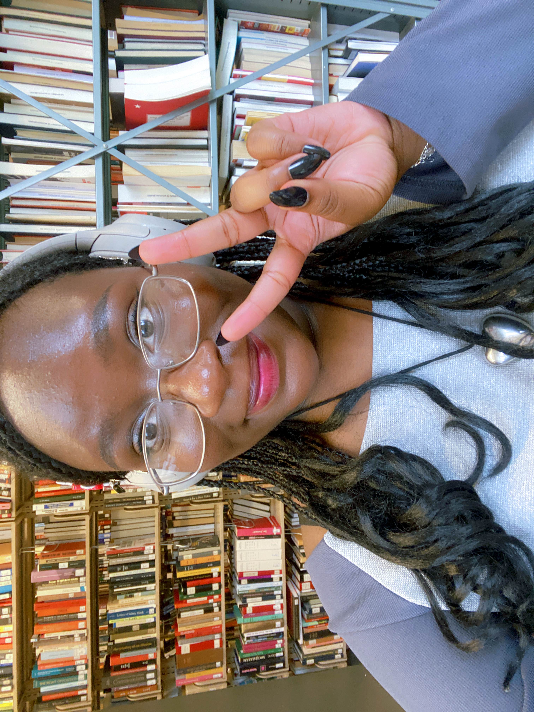

# About Me ...

  

I’m a student developer interested in game design and programming (among many other things)!
This site showcases the games I've developed as part of my Major Design Experience via EECS 494.

## Q: Favorite Game(s)?

A: My favorite game changes often, but my favorites fall into the thriller, mystery, horror genre (some of my faves being Danganronpa, Until Dawn, The Quarry, Resident Evil). Anything with a rich story or something that will immerse into some storyline, will likely fall into my favorites (honorable mentions: Detroit: Become Human, Mouthwashing, Heavy Rain, Undertale). I love a lighthearted game too, though! Among my favorite, more lighthearted games are Stardew Valley, Infinity Nikki (pre-update, iykyk), and Tomodachi Life.

### More info coming soon =3
